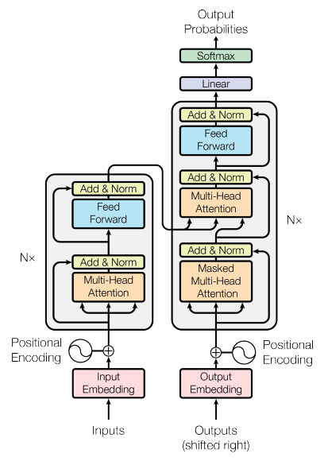
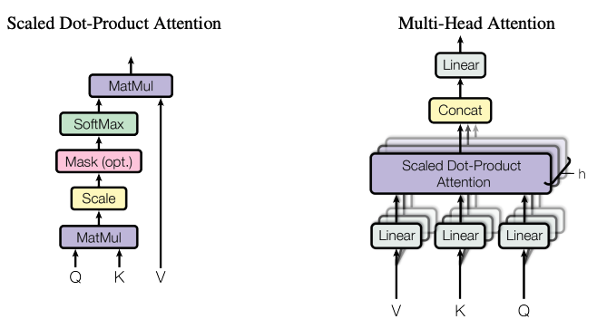

# Transformer
## 설명



트랜스포머(Transformer)는 2017년 "Attention is all you need"에서 제안한 모델로서, 인코더-디코더 구조를 따르면서 기존의 seq2seq와는 다르게 어텐션(Attention)만으로 구현한 모델이다.

기존의 RNN구조는 Time Step별로 계산이 이루어지는 반면에, 트랜스포머는 어텐션으로만 이루어져 있어 Positional Encoding을 통해 단어들의 위치 정보를 가질 수 있도록 했다.



트랜스포머의 어텐션 층(Attention Layer)은 Query와 Key, Value들의 벡터 연산을 통해 어텐션 스코어를 구한다. 여기서 Query, Key, Value는 입력된 단어의 임베딩값과 $W_q, W_k, W_v$의 행렬 연산을 통해 구한 값이다. 이렇게 구한 Query, Key, Value는 일련의 계산을 통해 어텐션 스코어를 구할 수 있다.

트랜스포머에서는 위와 같은 어텐션 층이 여러 개(8개)를 같고 있는데 이를 멀티 헤드 어텐션(Multi-Head-Attention)층이라고 부른다. 이렇게 여러 개의 어텐션을 두는 이유는 하나의 문장도 여러 개의 측면에서 고려할 수 있기 때문이다. 예를 들어, "공부하러 독서실에 갔다가 배가 고파서 집에 왔다."라는 문장에서 행동적인 측면에서는 "갔다."와 "왔다."에 집중할 수 있을 것이고 원인 측면에서는 "공부하러", "배가 고파서"에 집중할 수 있다. 이처럼 여러 개의 헤드를 두어 다양한 측면을 고려할 수 있도록 하였다.

디코더의 마스크드 멀티 헤드 어텐션(Masked Multi-Head Attention)은 AR(Auto Regressive)의 특성을 가지고 있기 때문에 앞선 정보를 확인할 수 없다. 따라서 현재 시점 이후의 정보들을 마스킹하여 이전의 정보만을 활용하여 다음 단어를 예측해야 하는 특징을 가지고 있다.

마지막으로 Cross Multi-Head Attention은 인코더의 어텐션 스코어를 활용하여 계산하는 층으로 이해할 수 있다.

마지막으로, 트랜스포머는 Residual connection과 Layer Normalization을 통해 층이 깊어져도 모델이 강건해지도록 하는 역할을 한다.

## 데이터

AI Hub : SNS 대화 데이터

## 학습 및 테스트 방법

```python
python3 main.py --mode {mode} --name {name} --config_path {config_path}
```

- mode : `train` or `test`

- name : model name to save or load

- config_path : path of `config.json`

